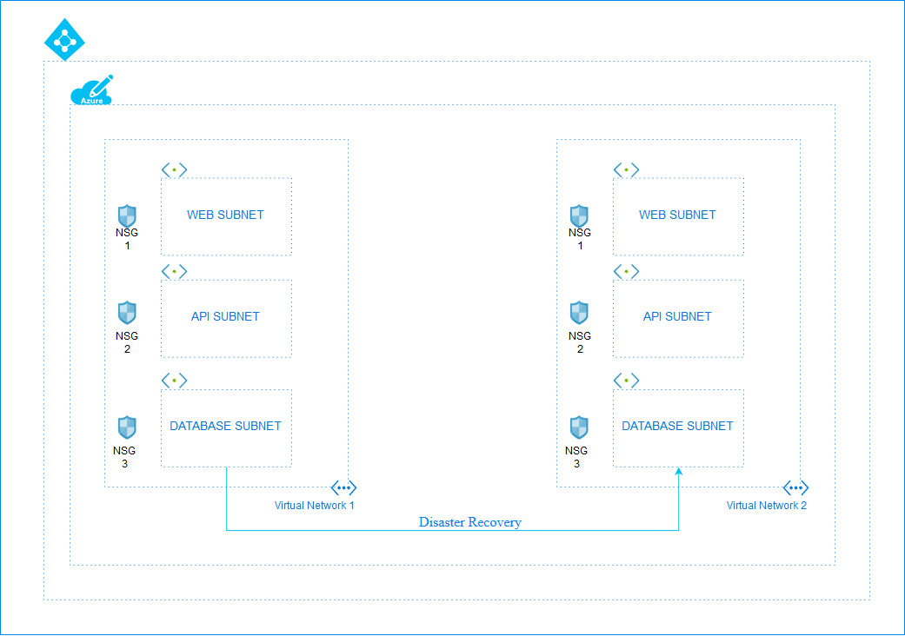

# Deploying Infrastructure as a code using Terraform

Terraform is a tool for building, changing, and versioning infrastructure safely and easily. It suppoorts existing cloud service providers and custom in house solutions. Terraform makes use of configureation files in order to keep track of the components to run. Before applying the updates to the infrastructure, terraform creates a plan of the same which we can use to double check the changes before any real time changes are made using the apply command. To know more about terraform, you can go through the [`documentation of Terraform`](https://www.terraform.io/docs/index.html).

## Implementing 3 tier WEB-API-DATABASE architecture using Terraform

WEB-API-DATABSE architecture is a three-tier architecture which is the basic model for developing a web database application and communication is done using this 3-level application logic.</br> 
At the base of the model lies the database tier where data gets stored in a database server and various CRUD operations are being performed here. Above the database tier lies the middle tier which contains the application logic and does all the communication between the user and the database. Lastly on the top lies the web tier which is the web client that is used to interact with the user. User puts their request through the web tier, which gets processed by the middle tier and accordingly operations are being performed on the data base tier.</br>

<p align="center">
</br>
Figure 1.1: Working of the Architecture 
</br></br>

Figure 1.2: Detailed Architecture in Azure
</p>
</br>
In case of disaster recovery the bash script may be executed on the database network security groups of both the locations to allow communication to the second Vnet's Database subnet from the first.</br>
## Description of Files
- deploy_with_secrules.tf - This file deploys the network security groups with predefined rules.
- deploy_without_secrules.tf - This file deploys the network security groups without any predefined rules.

## How to Deploy:
-  Install Terraform.
- [`Configure Azure`](https://docs.microsoft.com/en-us/azure/virtual-machines/linux/terraform-install-configure) so the Terraform can connect to Azure.
- Upload the required .tf file in Azure powershell.
- Type in the commands 
    ```
    terraform init
    terraform plan
    terraform apply
    ```